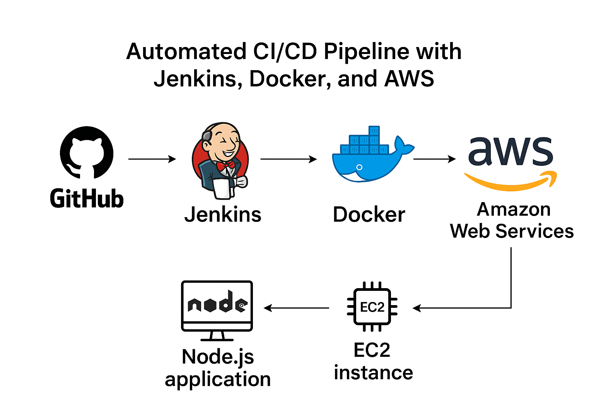

# Automated CI/CD Pipeline with Jenkins, Docker, and AWS

This project implements a CI/CD pipeline for a Node.js application using Jenkins and Docker, hosted on an AWS EC2 instance. The pipeline is designed to automate code integration, testing, and deployment, ensuring faster and more reliable delivery of updates. GitHub is integrated for version control, triggering automated builds upon code commits.





## Architecture


- #### AWS EC2: Used to host Jenkins and Docker.

- #### Jenkins: Manages CI/CD, triggers Docker build on GitHub commits.

- #### GitHub: Source code repository, integrated with Jenkins through webhooks.

- #### Docker: Containerizes the Node.js application and manages deployment.

- #### Node.js: Sample application built and deployed in this project.


## Steps to Set Up the Project


- ### Setting up AWS EC2 Instance
   
  - Launch an EC2 instance with Ubuntu.

  - SSH into the instance and run updates

```bash
  sudo apt update

```
- ### Installing Jenkins
 
  - Install OpenJDK and Jenkins

```bash
  sudo apt install openjdk-11-jre
  curl -fsSL https://pkg.jenkins.io/debian/jenkins.io.key | sudo tee /usr/share/keyrings/jenkins-keyring.asc > /dev/null
  echo deb [signed-by=/usr/share/keyrings/jenkins-keyring.asc] https://pkg.jenkins.io/debian binary/ | sudo tee /etc/apt/sources.list.d/jenkins.list > /dev/null
  sudo apt-get update
  sudo apt-get install jenkins
  sudo systemctl start jenkins
  sudo systemctl enable jenkins
```  
- ### Configuring Jenkins for GitHub Integration
 
  - In Jenkins, create a new job, select "Freestyle Project," and link it to your GitHub repository using webhooks to trigger builds.

- ### Installing and Configuring Docker
  - Install Docker on the EC2 instance

  ```bash
  sudo apt install docker.io
  sudo usermod -a -G docker $USER
  ``` 

  - Create a `Dockerfile` for the Node.js app

   ```bash
   FROM node:12.2.0-alpine
   WORKDIR /app
   COPY . .
   RUN npm install
   EXPOSE 8000
   CMD ["node", "app.js"]
   ```

- ### Jenkins Pipeline Configuration
  - In Jenkins, add the following shell commands to automate Docker build and run

  ```bash
  docker build -t node-app-todo .
  docker run -d --name node-app-container -p 8000:8000 node-app-todo
  ```

- ### Running the Pipeline
  - Upon code commits to the GitHub repository, Jenkins will:
    
    - Pull the latest code from GitHub.
    - Build the Docker image using the `Dockerfile`.
    - Deploy the Node.js app inside a Docker container on the EC2 instance.

- ### Testing the Deployment
  - Access the deployed Node.js app by navigating to the EC2 instance’s public IP on port 8000

  ```bash
  http://<ec2-public-ip>:8000
  ```

## Technologies Used -
  
   - Jenkins: Automates the CI/CD process.

   - GitHub: Stores the code and triggers Jenkins jobs.

   - Docker: Containerizes the application.

   - AWS EC2: Hosts Jenkins and Docker.

   - Node.js: Backend application framework.

   - Linux (Ubuntu): Operating system for the server.

## Future Improvements

  - Implement automated testing before the deployment stage.

  - Integrate Slack for real-time build notifications.

  - Expand to multi-environment deployment (e.g., staging, production).
  


